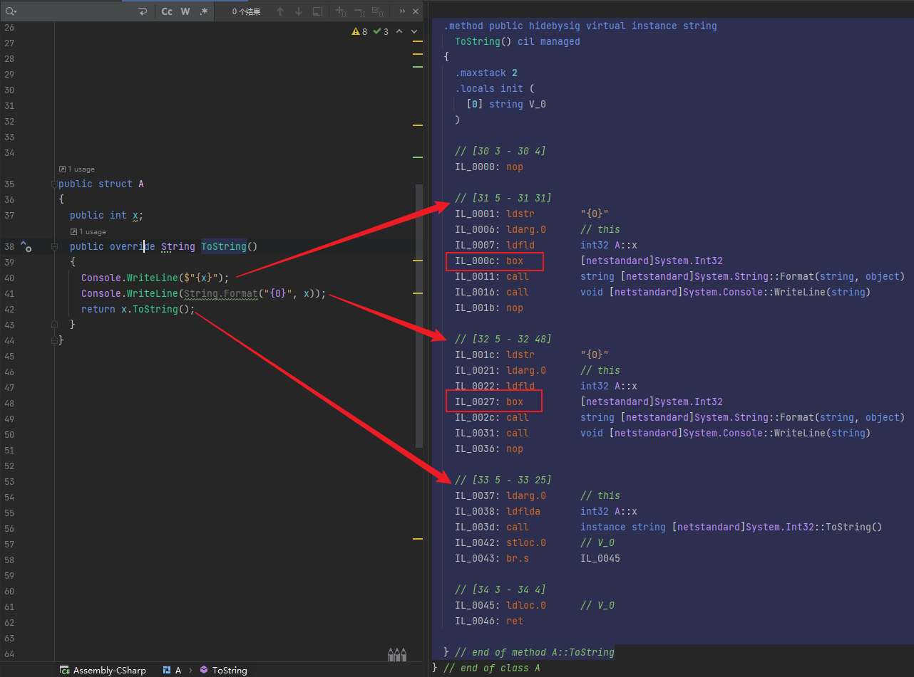

# Some definition

<details>

<summary><mark style="color:blue;">简述GC（Garbage Collector）垃圾收集器</mark></summary>


</details>

<details>

<summary><mark style="color:blue;">索引器 - 可以把类当成数组使用</mark></summary>

```csharp
class SampleCollection
  {
    private int[] arr = new int[] { 1, 2, 3, 4, 5, 6, 7 };
    public int this[int i]
    {
      get => arr[i];
      set => arr[i] = value;
    }

    public string this[string uc] => $"你输入了：{uc}";
    public string this[string ac, int uu] => $"两个参数诶：{ac}-{uu}";
  }

  private void Awake()
  {
    var stringCollection = new SampleCollection();

    print(stringCollection[0]);             // output: 1
    print(stringCollection[1]);             // output: 2
    print(stringCollection[2]);             // output: 3
    print(stringCollection["呀哈喽"]);      // output: 你输入了：呀哈喽
    print(stringCollection["呀哈喽", 486]); // output: 两个参数诶：呀哈喽-486
  }
```

索引器感觉就是个<mark style="color:red;">语法糖</mark>罢了，按照上面那样看，感觉和函数差不多,只是()变成了：\[]

</details>

<details>

<summary><mark style="color:blue;">用户自定义 类型转换：</mark></summary>

```csharp
  public class TestInt
  {
    private int digit;

    public TestInt(int digit)
    {
      this.digit = digit;
    }
    // public static implicit/explicit operator 是必要条件
    public static implicit operator int(TestInt d) => d.digit;              // implicit operator 隐式转换 int
    public static implicit operator string(TestInt d) => $"{d}-呀哈喽";      // implicit operator 隐式转换 string
    public static explicit operator TestInt(int b) => new TestInt(b);       // explicit operator 显式强制转换
    public override string ToString() => $"{digit}";
  }

  private void Awake()
  {
    var d = new TestInt(17);

    int number = d;                         // 进行了隐式转换
    print(number);                          // output: 17 

    string str = d;                         // 如果类 TestInt 没写对应类型的隐式转换则这里编译期间会报错
    print(str);                             // output: 17-呀哈喽

    TestInt digit = (TestInt)number;        // 显式强制转换
    print(digit);                           // output: 17
  }
```

</details>

<details>

<summary><mark style="color:blue;">运算符重载 - operator override</mark></summary>

重载和上面的 类显/隐式转换 差不多

```csharp
public class TestInt
{
  // public static operator x 是必要条件
  public static TestInt operator +(TestInt a) => a;
  public static TestInt operator -(TestInt a) => new TestInt();
  public static TestInt operator +(TestInt a, TestInt b) => new TestInt();
  public static TestInt operator -(TestInt a, TestInt b) => a + (-b);
  public static TestInt operator *(TestInt a, TestInt b) => new TestInt();
  public static TestInt operator /(TestInt a, TestInt b) => new TestInt();

  public static bool operator ==(TestInt a, TestInt b)
  {
    Debug.Log("呀哈喽");
    return false;
  }
  public static bool operator !=(TestInt a, TestInt b) => false;
}
```

</details>

<details>

<summary><mark style="color:blue;"><strong>装箱Boxing - 拆箱UnBoxing</strong></mark></summary>

<mark style="color:yellow;">装箱是将值类型隐式转换为引用类型，拆箱是将引用类型转换为值类型。</mark>

应用：调用一个含类型为 <mark style="color:blue;">`Object`</mark> 的参数的方法，该 <mark style="color:blue;">`Object`</mark> 可支持任意类型，可以通用。但是值类型转换为引用类型所造成的装箱，生成的是全新的堆引用对象，这会有时间损耗，也就是造成效率降低。而拆箱时候，生成新的栈实例后，无法修改被装箱对象。装箱过程伴随着新的堆空间的开辟和值的复制，但是拆箱过程仅仅只是找到对象中指向值的指针，而拆箱后发生的值复制到栈实例中则是不属于拆箱的过程。但是殊途同归，复制会影响一定的性能。

<mark style="color:blue;">`C#`</mark> <mark style="color:blue;"></mark><mark style="color:blue;"></mark> 中对装箱和拆箱都是隐式的，所以要么尽量避免装箱和拆箱，要么在循环中提前进行/绕过装箱和拆箱。

<mark style="color:green;">**关于值类型的装箱避免**</mark>


```csharp
public struct A 
{ 
  public int x;
  public override String ToString()
  {
    Console.WriteLine($"{x}");
    Console.WriteLine(String.Format("{0}", x));
    return x.ToString();
  }
}
```




</details>


<details>

<summary><mark style="color:blue;">IDisposable 接口</mark></summary>

IDisposable接口，IDisposable接口定义了Dispose方法，这个方法用来供程序员显式调用以释放非托管资源。使用using 语句可以简化资源管理。

</details>





